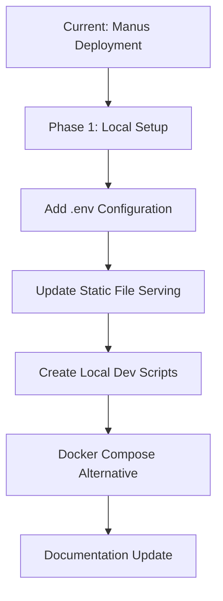
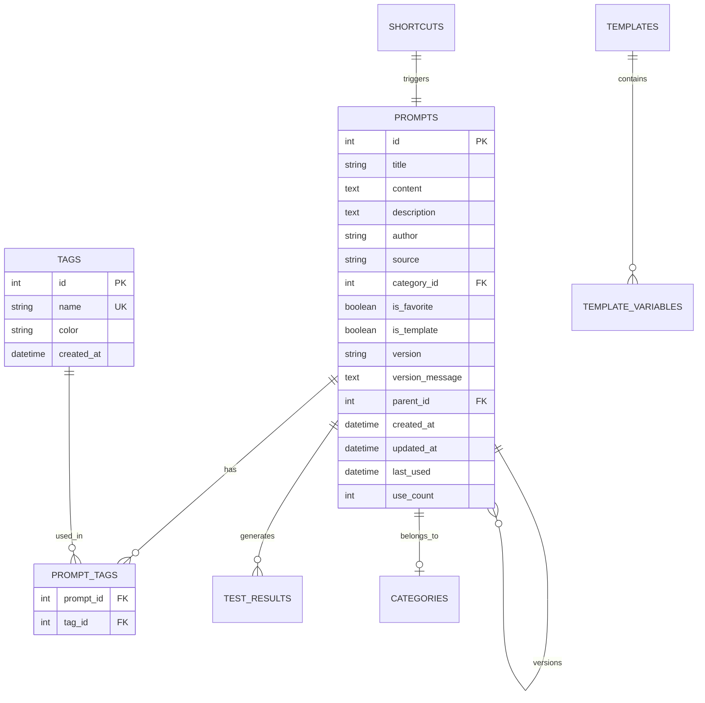
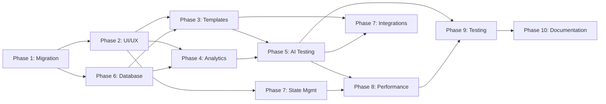

# PromptLab Transformation Architecture Plan

**Version:** 1.0  
**Date:** November 2, 2025  
**Target:** Transform from Manus MVP to World-Class Standalone Personal IDE

---

## Executive Summary

This document outlines the comprehensive architectural plan to transform PromptLab from a Manus-deployed MVP into a world-class, standalone personal Prompt Engineering IDE. The transformation prioritizes:

1. **UI/UX Excellence** - Modern design system inspired by Linear, Raycast, Arc Browser, and Notion
2. **Template System** - Variable interpolation and AI-powered autofill
3. **Advanced Analytics** - Rich visualizations and insights
4. **AI Testing Workbench** - Multi-model testing with streaming and cost tracking
5. **External Integrations** - Git, cloud storage, and third-party app sync

---

## 1. Manus Platform Migration Plan

### 1.1 Current Manus Dependencies

**Identified Manus-Specific Elements:**
- Deployment platform (https://nghki1cjm611.manus.space)
- Static file hosting configuration in [`main.py`](main.py:14)
- No authentication layer (relies on Manus platform security)
- Hardcoded secrets in [`main.py`](main.py:15): `SECRET_KEY = 'asdf#FGSgvasgf$5$WGT'`
- Build process assumes Manus deployment tools

**Files Requiring Modification:**
- [`main.py`](main.py) - Remove Manus-specific hosting, add .env support
- [`vite.config.js`](vite.config.js) - Update proxy configuration for local dev
- [`package.json`](package.json) - No Manus-specific dependencies found ✓

### 1.2 Migration Strategy



**Step-by-Step Migration:**

1. **Environment Variables Setup**
   ```bash
   # Create .env file
   FLASK_ENV=development
   SECRET_KEY=<generate-new-secure-key>
   DATABASE_URL=sqlite:///database/app.db
   CORS_ORIGINS=http://localhost:5173
   
   # AI API Keys
   OPENAI_API_KEY=<your-key>
   ANTHROPIC_API_KEY=<your-key>
   GOOGLE_API_KEY=<your-key>
   ```

2. **Update main.py**
   ```python
   import os
   from dotenv import load_dotenv
   
   load_dotenv()
   
   app.config['SECRET_KEY'] = os.getenv('SECRET_KEY')
   # Use environment-based CORS
   CORS(app, origins=os.getenv('CORS_ORIGINS', '*').split(','))
   ```

3. **Local Development Scripts**
   ```json
   // package.json additions
   "scripts": {
     "dev:full": "concurrently \"npm run dev\" \"python main.py\"",
     "setup": "npm install && pip install -r requirements.txt"
   }
   ```

4. **Docker Compose Setup**
   ```yaml
   version: '3.8'
   services:
     backend:
       build: .
       ports:
         - "5002:5002"
       environment:
         - FLASK_ENV=production
       volumes:
         - ./database:/app/database
     
     frontend:
       build:
         context: .
         dockerfile: Dockerfile.frontend
       ports:
         - "80:80"
       depends_on:
         - backend
   ```

---

## 2. Technology Stack Recommendations

### 2.1 Frontend Stack

| Category | Library | Version | Purpose |
|----------|---------|---------|---------|
| **Core** | React | 18.2+ | UI framework |
| | Vite | 5.0+ | Build tool |
| **UI Components** | Shadcn/UI | Latest | Component library |
| | Radix UI | 1.1+ | Headless primitives |
| | Tailwind CSS | 3.3+ | Styling |
| **Animations** | Framer Motion | 11.0+ | Micro-interactions & transitions |
| **State Management** | Zustand | 4.4+ | Global state (lightweight, performant) |
| **Data Fetching** | React Query | 5.0+ | Server state & caching |
| **Charts** | Recharts | 2.10+ | Analytics visualizations |
| **Icons** | Lucide React | 0.294+ | Icon system |
| **Utilities** | clsx + tailwind-merge | Latest | Class name utilities |
| **Toast/Notifications** | Sonner | 2.0+ | Toast system |

### 2.2 Backend Stack

| Category | Library | Version | Purpose |
|----------|---------|---------|---------|
| **Framework** | Flask | 3.0+ | Web framework |
| **ORM** | SQLAlchemy | 2.0+ | Database ORM |
| **Database** | SQLite | 3.x | Development database |
| **CORS** | Flask-CORS | 4.0+ | Cross-origin support |
| **Environment** | python-dotenv | 1.0+ | Environment management |
| **AI APIs** | openai | 1.0+ | OpenAI integration |
| | anthropic | 0.7+ | Anthropic Claude integration |
| | google-generativeai | 0.3+ | Google Gemini integration |
| **Token Counting** | tiktoken | 0.5+ | Token calculation |
| **Testing** | pytest | 7.4+ | Unit testing |
| | pytest-flask | 1.3+ | Flask testing utilities |

### 2.3 Development Tools

```bash
# Frontend
npm install --save-dev \
  @vitejs/plugin-react \
  autoprefixer \
  postcss \
  tailwindcss \
  vite-bundle-visualizer \
  vitest \
  @testing-library/react \
  @testing-library/jest-dom

# Additional Production Dependencies
npm install \
  framer-motion \
  zustand \
  @tanstack/react-query \
  recharts \
  react-virtuoso \
  react-markdown \
  remark-gfm

# Backend
pip install \
  openai \
  anthropic \
  google-generativeai \
  tiktoken \
  flask-sse \
  redis
```

---

## 3. Database Schema Updates

### 3.1 Current Issues

**Problem:** Tags stored as JSON strings in [`prompts.tags`](src/models/prompt.py:35)
```python
# Current inefficient approach
tags = db.Column(db.Text)  # JSON string
```

### 3.2 Proposed Schema



### 3.3 Migration Script

```python
# migrations/001_tags_to_relational.py
"""
Migration: Convert JSON tags to relational table
"""

from sqlalchemy import text

def upgrade(db):
    # Create tags table
    db.session.execute(text("""
        CREATE TABLE tags (
            id INTEGER PRIMARY KEY AUTOINCREMENT,
            name VARCHAR(50) NOT NULL UNIQUE,
            color VARCHAR(7) DEFAULT '#3B82F6',
            created_at DATETIME DEFAULT CURRENT_TIMESTAMP
        )
    """))
    
    # Create junction table
    db.session.execute(text("""
        CREATE TABLE prompt_tags (
            prompt_id INTEGER NOT NULL,
            tag_id INTEGER NOT NULL,
            PRIMARY KEY (prompt_id, tag_id),
            FOREIGN KEY (prompt_id) REFERENCES prompts(id) ON DELETE CASCADE,
            FOREIGN KEY (tag_id) REFERENCES tags(id) ON DELETE CASCADE
        )
    """))
    
    # Migrate existing JSON tags
    db.session.execute(text("""
        -- Migration logic to extract JSON tags and populate new tables
    """))
    
    db.session.commit()

def downgrade(db):
    db.session.execute(text("DROP TABLE IF EXISTS prompt_tags"))
    db.session.execute(text("DROP TABLE IF EXISTS tags"))
    db.session.commit()
```

### 3.4 New Tables for Advanced Features

```sql
-- Template Variables
CREATE TABLE template_variables (
    id INTEGER PRIMARY KEY AUTOINCREMENT,
    template_id INTEGER NOT NULL,
    variable_name VARCHAR(100) NOT NULL,
    variable_type VARCHAR(50) DEFAULT 'text',
    default_value TEXT,
    description TEXT,
    required BOOLEAN DEFAULT FALSE,
    FOREIGN KEY (template_id) REFERENCES prompt_templates(id) ON DELETE CASCADE
);

-- Clipboard History
CREATE TABLE clipboard_history (
    id INTEGER PRIMARY KEY AUTOINCREMENT,
    content TEXT NOT NULL,
    prompt_id INTEGER,
    created_at DATETIME DEFAULT CURRENT_TIMESTAMP,
    FOREIGN KEY (prompt_id) REFERENCES prompts(id) ON DELETE SET NULL
);

-- Analytics Events
CREATE TABLE analytics_events (
    id INTEGER PRIMARY KEY AUTOINCREMENT,
    event_type VARCHAR(50) NOT NULL,
    prompt_id INTEGER,
    metadata TEXT,
    created_at DATETIME DEFAULT CURRENT_TIMESTAMP,
    FOREIGN KEY (prompt_id) REFERENCES prompts(id) ON DELETE SET NULL
);

-- Create indexes for performance
CREATE INDEX idx_prompts_category ON prompts(category_id);
CREATE INDEX idx_prompts_favorite ON prompts(is_favorite);
CREATE INDEX idx_prompts_last_used ON prompts(last_used DESC);
CREATE INDEX idx_test_results_prompt ON test_results(prompt_id);
CREATE INDEX idx_analytics_events_type ON analytics_events(event_type);
CREATE INDEX idx_analytics_events_created ON analytics_events(created_at DESC);
```

---

## 4. API Architecture

### 4.1 New API Endpoints

```python
# API Structure
/api/v1/
    /prompts/                    # Existing
    /categories/                 # Existing
    /tags/                       # NEW
        GET    /                 # List all tags
        POST   /                 # Create tag
        PUT    /:id              # Update tag
        DELETE /:id              # Delete tag
    
    /templates/                  # NEW
        GET    /                 # List templates
        POST   /                 # Create template
        GET    /:id              # Get template
        PUT    /:id              # Update template
        POST   /:id/fill         # AI-powered autofill
        
    /shortcuts/                  # NEW
        GET    /                 # List shortcuts
        POST   /                 # Create shortcut
        PUT    /:id              # Update shortcut
        DELETE /:id              # Delete shortcut
        
    /testing/                    # NEW
        POST   /run              # Run single test
        POST   /batch            # Run batch tests
        POST   /stream           # SSE endpoint for streaming
        GET    /sessions         # List test sessions
        GET    /sessions/:id     # Get session results
        
    /analytics/                  # NEW
        GET    /summary          # Dashboard summary
        GET    /usage            # Usage trends
        GET    /costs            # Cost analysis
        GET    /performance      # Performance metrics
        
    /clipboard/                  # NEW
        GET    /history          # Get clipboard history
        POST   /                 # Save to clipboard
        DELETE /:id              # Delete entry
```

### 4.2 Request/Response Formats

```typescript
// Template Creation
POST /api/v1/templates
{
  "name": "Customer Email Template",
  "template": "Hi {{customer_name}},\n\n{{message}}\n\nBest regards,\n{{signature}}",
  "variables": [
    { "name": "customer_name", "type": "text", "required": true },
    { "name": "message", "type": "text", "required": true },
    { "name": "signature", "type": "text", "default": "The Team" }
  ]
}

// AI Test Run
POST /api/v1/testing/run
{
  "prompt_id": 123,
  "model": "gpt-4o",
  "parameters": {
    "temperature": 0.7,
    "max_tokens": 2000,
    "system_message": "You are a helpful assistant"
  }
}

// Streaming Response (SSE)
POST /api/v1/testing/stream
Event: message
Data: {"chunk": "Hello", "tokens": 1}

Event: message  
Data: {"chunk": " world", "tokens": 2}

Event: complete
Data: {"total_tokens": 150, "cost": 0.003}
```

### 4.3 Backend Implementation Structure

```python
# src/routes/testing.py
from flask import Blueprint, Response, stream_with_context
import openai
import anthropic
import google.generativeai as genai
from ..services.ai_service import AIService

testing_bp = Blueprint('testing', __name__)

@testing_bp.route('/testing/stream', methods=['POST'])
def stream_test():
    def generate():
        data = request.get_json()
        service = AIService(data['model'])
        
        for chunk in service.stream_response(data['prompt']):
            yield f"data: {json.dumps(chunk)}\n\n"
    
    return Response(
        stream_with_context(generate()),
        mimetype='text/event-stream'
    )
```

---

## 5. UI Component Architecture

### 5.1 Design System Token Structure

```typescript
// src/design-system/tokens.ts
export const designTokens = {
  colors: {
    // Semantic colors
    primary: {
      50: 'hsl(222, 47%, 95%)',
      100: 'hsl(222, 47%, 90%)',
      // ... through 900
      DEFAULT: 'hsl(222, 47%, 50%)'
    },
    // Status colors
    success: { /* ... */ },
    warning: { /* ... */ },
    error: { /* ... */ },
  },
  
  spacing: {
    0: '0',
    px: '1px',
    0.5: '0.125rem',
    1: '0.25rem',
    // ... geometric progression
  },
  
  typography: {
    fontFamily: {
      sans: ['Inter', 'system-ui', 'sans-serif'],
      mono: ['Fira Code', 'monospace']
    },
    fontSize: {
      xs: ['0.75rem', { lineHeight: '1rem' }],
      // ... through 9xl
    }
  },
  
  shadows: {
    sm: '0 1px 2px 0 rgb(0 0 0 / 0.05)',
    DEFAULT: '0 1px 3px 0 rgb(0 0 0 / 0.1)',
    md: '0 4px 6px -1px rgb(0 0 0 / 0.1)',
    // ... through 2xl with inner shadow variants
  },
  
  animation: {
    durations: {
      fast: '150ms',
      base: '250ms',
      slow: '350ms'
    },
    easings: {
      smooth: 'cubic-bezier(0.4, 0, 0.2, 1)',
      spring: 'cubic-bezier(0.68, -0.55, 0.265, 1.55)'
    }
  }
}
```

### 5.2 Component Hierarchy

```
App
├── ThemeProvider (enhanced)
├── StateProvider (Zustand)
├── QueryProvider (React Query)
└── Router
    ├── Layout
    │   ├── Header (enhanced with animations)
    │   ├── Sidebar (collapsible with spring animation)
    │   └── MainContent
    │       ├── PromptManagement
    │       │   ├── PromptList (virtualized)
    │       │   │   ├── PromptCard (micro-interactions)
    │       │   │   └── EmptyState
    │       │   └── PromptEditor (enhanced)
    │       │       ├── MarkdownPreview
    │       │       ├── VariableInserter
    │       │       └── ShortcutExpander
    │       │
    │       ├── TemplateSystem
    │       │   ├── TemplateEditor
    │       │   ├── VariableManager
    │       │   └── AIAutofill
    │       │
    │       ├── TestingWorkbench
    │       │   ├── ConfigPanel
    │       │   ├── MultiModelTester
    │       │   │   ├── StreamingChat
    │       │   │   └── ResponseComparison
    │       │   └── ResultsAnalyzer
    │       │
    │       ├── Analytics
    │       │   ├── DashboardSummary
    │       │   ├── UsageTrends (Recharts)
    │       │   ├── CostAnalysis (Recharts)
    │       │   └── DateRangeSelector
    │       │
    │       └── Settings
    │           ├── CategoryManager
    │           ├── APIKeyManager
    │           └── IntegrationSettings
    │
    └── CommandPalette (enhanced with sections)
```

### 5.3 Design Pattern Inspirations

**Linear-Inspired:**
- Fast keyboard shortcuts (⌘K command palette)
- Smooth page transitions
- Clean, minimal interface
- Focus on content

**Raycast-Inspired:**
- Command palette with sections
- Quick actions and shortcuts
- Instant search with fuzzy matching
- Contextual actions

**Arc Browser-Inspired:**
- Collapsible sidebar with smooth animation
- Space-based organization (Categories)
- Clean, distraction-free workspace
- Beautiful color system

**Notion-Inspired:**
- Flexible content blocks
- Drag-and-drop organization
- Markdown support with live preview
- Database-like views for prompts

### 5.4 Micro-Interactions Specification

```typescript
// Framer Motion variants
export const animations = {
  // Button hover
  buttonHover: {
    scale: 1.02,
    transition: { duration: 0.15 }
  },
  
  // Card entrance
  cardEntrance: {
    initial: { opacity: 0, y: 20 },
    animate: { opacity: 1, y: 0 },
    transition: { duration: 0.25 }
  },
  
  // Sidebar collapse
  sidebarCollapse: {
    open: { width: 280, opacity: 1 },
    closed: { width: 60, opacity: 0.8 },
    transition: { type: "spring", damping: 20 }
  },
  
  // List item stagger
  listStagger: {
    animate: {
      transition: { staggerChildren: 0.05 }
    }
  }
}
```

---

## 6. Implementation Phases with Dependencies



### Priority Order Summary

1. **Phase 1: Foundation** (Week 1)
   - Remove Manus dependencies
   - Environment setup
   - Docker configuration

2. **Phase 2: UI/UX Excellence** (Weeks 2-3)
   - Design system implementation
   - Framer Motion integration
   - Component enhancements

3. **Phase 3: Template System** (Week 4)
   - Template engine
   - Variable interpolation
   - AI-powered autofill

4. **Phase 6: Database Optimization** (Week 5)
   - Tags refactor
   - New tables
   - Indexes

5. **Phase 4: Analytics** (Week 6)
   - Recharts integration
   - Dashboard components
   - Data aggregation

6. **Phase 5: AI Testing** (Weeks 7-8)
   - Multi-model integration
   - Streaming implementation
   - Result comparison

7. **Phase 7: State & Integrations** (Week 9)
   - Zustand setup
   - External APIs

8. **Phase 8: Performance** (Week 10)
   - Optimizations
   - Code splitting

9. **Phase 9: Testing** (Week 11)
   - Unit tests
   - Integration tests

10. **Phase 10: Documentation** (Week 12)
    - Comprehensive docs
    - Migration guides

---

## 7. Development Environment Setup

### 7.1 Prerequisites

```bash
# System Requirements
- Node.js 18+ with npm/pnpm
- Python 3.11+
- Git
- (Optional) Docker & Docker Compose

# Pop!_OS Specific
sudo apt update
sudo apt install python3-pip python3-venv nodejs npm
```

### 7.2 Local Setup Steps

```bash
# 1. Clone and enter directory
git clone <repo-url> promptlab
cd promptlab

# 2. Backend setup
python3 -m venv venv
source venv/bin/activate
pip install -r requirements.txt

# 3. Frontend setup
npm install
# or
pnpm install

# 4. Environment configuration
cp .env.example .env
# Edit .env with your API keys and settings

# 5. Database initialization
python -c "from main import app, db; app.app_context().push(); db.create_all()"

# 6. Run development servers
# Terminal 1 - Backend
python main.py

# Terminal 2 - Frontend
npm run dev

# Access app at http://localhost:5173
```

### 7.3 Docker Setup

```bash
# Build and run with Docker Compose
docker-compose up -d

# Access app at http://localhost

# View logs
docker-compose logs -f

# Stop
docker-compose down
```

### 7.4 Development Scripts

```json
{
  "scripts": {
    "dev": "vite",
    "dev:backend": "python main.py",
    "dev:full": "concurrently \"npm run dev\" \"npm run dev:backend\"",
    "build": "vite build",
    "preview": "vite preview",
    "test": "vitest",
    "test:backend": "pytest",
    "lint": "eslint src --ext js,jsx",
    "format": "prettier --write \"src/**/*.{js,jsx}\"",
    "analyze": "vite-bundle-visualizer"
  }
}
```

---

## 8. Security Architecture

### 8.1 Environment-Based Configuration

```bash
# .env (never commit!)
# Flask Configuration
FLASK_ENV=development
SECRET_KEY=<generate-with: python -c 'import secrets; print(secrets.token_hex(32))'>
DATABASE_URL=sqlite:///database/app.db

# CORS Configuration
CORS_ORIGINS=http://localhost:5173,http://localhost:5002

# AI Service API Keys
OPENAI_API_KEY=sk-...
ANTHROPIC_API_KEY=sk-ant-...
GOOGLE_API_KEY=AIza...

# Optional: Future features
GITHUB_TOKEN=ghp_...
NOTION_API_KEY=secret_...
```

### 8.2 API Key Management

```python
# src/services/api_key_service.py
import os
from cryptography.fernet import Fernet

class APIKeyService:
    """Secure API key management"""
    
    def __init__(self):
        self.keys = {
            'openai': os.getenv('OPENAI_API_KEY'),
            'anthropic': os.getenv('ANTHROPIC_API_KEY'),
            'google': os.getenv('GOOGLE_API_KEY')
        }
    
    def get_key(self, service: str) -> str:
        """Retrieve API key for service"""
        if service not in self.keys:
            raise ValueError(f"Unknown service: {service}")
        
        key = self.keys[service]
        if not key:
            raise ValueError(f"API key not configured for {service}")
        
        return key
    
    def validate_key(self, service: str) -> bool:
        """Check if API key is configured"""
        return self.keys.get(service) is not None
```

### 8.3 Input Validation

```python
# src/validators/prompt_validator.py
from marshmallow import Schema, fields, validate

class PromptSchema(Schema):
    title = fields.Str(required=True, validate=validate.Length(min=1, max=200))
    content = fields.Str(required=True, validate=validate.Length(min=1))
    description = fields.Str(validate=validate.Length(max=1000))
    category_id = fields.Int()
    tags = fields.List(fields.Str(validate=validate.Length(max=50)))
    is_favorite = fields.Bool()
    is_template = fields.Bool()

def validate_prompt_data(data):
    schema = PromptSchema()
    return schema.load(data)
```

### 8.4 CORS Configuration

```python
# main.py - Production CORS setup
from flask_cors import CORS

# Development
if app.config['FLASK_ENV'] == 'development':
    CORS(app, origins=['http://localhost:5173'])
else:
    # Production - restrict to your domain
    allowed_origins = os.getenv('CORS_ORIGINS', '').split(',')
    CORS(app, origins=allowed_origins)
```

---

## 9. Performance Optimization Strategy

### 9.1 Frontend Optimizations

```javascript
// Code Splitting
import { lazy, Suspense } from 'react'
import { LoadingSpinner } from './components/ui/loading'

const Analytics = lazy(() => import('./Analytics'))
const TestingWorkbench = lazy(() => import('./TestingWorkbench'))

function App() {
  return (
    <Suspense fallback={<LoadingSpinner />}>
      <Routes>
        <Route path="/analytics" element={<Analytics />} />
        <Route path="/testing" element={<TestingWorkbench />} />
      </Routes>
    </Suspense>
  )
}
```

```javascript
// Virtual Scrolling with react-virtuoso
import { Virtuoso } from 'react-virtuoso'

export function PromptList({ prompts }) {
  return (
    <Virtuoso
      data={prompts}
      itemContent={(index, prompt) => (
        <PromptCard key={prompt.id} prompt={prompt} />
      )}
      style={{ height: '100%' }}
    />
  )
}
```

```javascript
// React Query for Caching
import { useQuery, useMutation, useQueryClient } from '@tanstack/react-query'

export function usePrompts() {
  return useQuery({
    queryKey: ['prompts'],
    queryFn: fetchPrompts,
    staleTime: 5 * 60 * 1000, // 5 minutes
    cacheTime: 10 * 60 * 1000, // 10 minutes
  })
}

export function useUpdatePrompt() {
  const queryClient = useQueryClient()
  
  return useMutation({
    mutationFn: updatePrompt,
    onSuccess: () => {
      queryClient.invalidateQueries(['prompts'])
    }
  })
}
```

### 9.2 Backend Optimizations

```python
# Database Connection Pooling
from sqlalchemy.pool import QueuePool

app.config['SQLALCHEMY_ENGINE_OPTIONS'] = {
    'poolclass': QueuePool,
    'pool_size': 10,
    'pool_recycle': 3600,
    'pool_pre_ping': True
}
```

```python
# Pagination for Large Datasets
@prompt_bp.route('/prompts', methods=['GET'])
def get_prompts():
    page = request.args.get('page', 1, type=int)
    per_page = request.args.get('per_page', 50, type=int)
    
    query = Prompt.query
    paginated = query.paginate(page=page, per_page=per_page)
    
    return jsonify({
        'prompts': [p.to_dict() for p in paginated.items],
        'total': paginated.total,
        'pages': paginated.pages,
        'current_page': page
    })
```

```python
# Query Optimization with Eager Loading
prompts = Prompt.query\
    .options(joinedload(Prompt.category))\
    .options(joinedload(Prompt.tags))\
    .all()
```

### 9.3 Bundle Size Optimization

```javascript
// vite.config.js
export default defineConfig({
  build: {
    rollupOptions: {
      output: {
        manualChunks: {
          'vendor': ['react', 'react-dom', 'react-router-dom'],
          'ui': ['@radix-ui/react-dialog', '@radix-ui/react-dropdown-menu'],
          'charts': ['recharts'],
          'animations': ['framer-motion']
        }
      }
    },
    chunkSizeWarningLimit: 1000
  },
  plugins: [
    visualizer({ open: true }) // Analyze bundle
  ]
})
```

---

## 10. Testing Strategy

### 10.1 Frontend Testing Stack

```bash
npm install --save-dev \
  vitest \
  @testing-library/react \
  @testing-library/jest-dom \
  @testing-library/user-event \
  jsdom
```

```javascript
// src/components/__tests__/PromptCard.test.jsx
import { render, screen, fireEvent } from '@testing-library/react'
import { describe, it, expect, vi } from 'vitest'
import { PromptCard } from '../PromptCard'

describe('PromptCard', () => {
  it('renders prompt title and description', () => {
    const prompt = {
      id: 1,
      title: 'Test Prompt',
      description: 'A test prompt'
    }
    
    render(<PromptCard prompt={prompt} />)
    
    expect(screen.getByText('Test Prompt')).toBeInTheDocument()
    expect(screen.getByText('A test prompt')).toBeInTheDocument()
  })
  
  it('calls onSelect when clicked', () => {
    const onSelect = vi.fn()
    const prompt = { id: 1, title: 'Test' }
    
    render(<PromptCard prompt={prompt} onSelect={onSelect} />)
    fireEvent.click(screen.getByRole('button'))
    
    expect(onSelect).toHaveBeenCalledWith(prompt)
  })
})
```

### 10.2 Backend Testing

```python
# tests/test_prompt_routes.py
import pytest
from main import app, db
from src.models.prompt import Prompt

@pytest.fixture
def client():
    app.config['TESTING'] = True
    app.config['SQLALCHEMY_DATABASE_URI'] = 'sqlite:///:memory:'
    
    with app.test_client() as client:
        with app.app_context():
            db.create_all()
        yield client
        with app.app_context():
            db.drop_all()

def test_create_prompt(client):
    response = client.post('/api/prompts', json={
        'title': 'Test Prompt',
        'content': 'Test content'
    })
    
    assert response.status_code == 201
    data = response.get_json()
    assert data['title'] == 'Test Prompt'

def test_get_prompts(client):
    # Create test data
    with app.app_context():
        prompt = Prompt(title='Test', content='Content')
        db.session.add(prompt)
        db.session.commit()
    
    response = client.get('/api/prompts')
    assert response.status_code == 200
    data = response.get_json()
    assert len(data) == 1
```

### 10.3 E2E Testing (Future)

```javascript
// tests/e2e/prompt-workflow.spec.js
import { test, expect } from '@playwright/test'

test('complete prompt creation workflow', async ({ page }) => {
  await page.goto('http://localhost:5173')
  
  // Click new prompt button
  await page.click('[data-testid="new-prompt"]')
  
  // Fill form
  await page.fill('[name="title"]', 'My Test Prompt')
  await page.fill('[name="content"]', 'This is test content')
  
  // Save
  await page.click('[data-testid="save-prompt"]')
  
  // Verify toast
  await expect(page.locator('.toast')).toContainText('saved successfully')
  
  // Verify in list
  await expect(page.locator('.prompt-list')).toContainText('My Test Prompt')
})
```

---

## 11. Technology Decision Matrix

| Feature | Option A | Option B | Decision | Rationale |
|---------|----------|----------|----------|-----------|
| State Management | Redux Toolkit | **Zustand** | Zustand | Lightweight, less boilerplate, better DX |
| Data Fetching | SWR | **React Query** | React Query | Better cache management, more features |
| Charts | Chart.js | **Recharts** | Recharts | Better React integration, declarative |
| Database | **SQLite** | PostgreSQL | SQLite + migration path | Simplicity for personal use, easy backup |
| Animations | GSAP | **Framer Motion** | Framer Motion | React-first, declarative, spring physics |
| Virtual Scrolling | react-window | **react-virtuoso** | Virtuoso | Easier API, better features |
| Token Counting | js-tiktoken | **tiktoken** | tiktoken (Python) | Official OpenAI library, accurate |
| AI Streaming | Polling | **SSE** | Server-Sent Events | Real-time, simpler than WebSockets |

---

## 12. File Structure

```
PromptLab/
├── src/
│   ├── components/
│   │   ├── ui/              # Shadcn components
│   │   ├── prompts/         # Prompt-specific components
│   │   ├── templates/       # Template system
│   │   ├── testing/         # Testing workbench
│   │   ├── analytics/       # Charts and analytics
│   │   └── shared/          # Shared components
│   │
│   ├── design-system/
│   │   ├── tokens.ts        # Design tokens
│   │   ├── animations.ts    # Framer Motion variants
│   │   └── theme.ts         # Theme configuration
│   │
│   ├── stores/              # Zustand stores
│   │   ├── promptStore.ts
│   │   ├── uiStore.ts
│   │   └── settingsStore.ts
│   │
│   ├── hooks/               # Custom React hooks
│   │   ├── usePrompts.ts
│   │   ├── useTemplates.ts
│   │   └── useAITesting.ts
│   │
│   ├── services/            # Backend services (Python)
│   │   ├── ai_service.py
│   │   ├── api_key_service.py
│   │   └── analytics_service.py
│   │
│   ├── models/              # Database models
│   │   ├── prompt.py
│   │   ├── template.py
│   │   └── tag.py
│   │
│   └── routes/              # API routes
│       ├── prompt.py
│       ├── template.py
│       ├── testing.py
│       └── analytics.py
│
├── database/
│   ├── app.db
│   └── migrations/
│
├── tests/
│   ├── frontend/
│   └── backend/
│
├── docs/
│   ├── API.md
│   ├── SETUP.md
│   └── MIGRATION.md
│
├── .env.example
├── docker-compose.yml
├── Dockerfile
└── README.md
```

---

## 13. Quick Reference

### Key Commands
```bash
# Development
npm run dev                   # Start frontend
python main.py               # Start backend
npm run dev:full             # Start both concurrently

# Building
npm run build                # Build frontend
docker-compose up --build    # Build and run containers

# Testing
npm test                     # Run frontend tests
pytest                       # Run backend tests

# Database
python -m flask db migrate   # Create migration
python -m flask db upgrade   # Apply migrations
```

### Environment Variables
```bash
# Essential
SECRET_KEY                   # Flask secret key
DATABASE_URL                 # Database connection string

# AI Services
OPENAI_API_KEY              # OpenAI API key
ANTHROPIC_API_KEY           # Anthropic API key  
GOOGLE_API_KEY              # Google Gemini API key

# Optional
CORS_ORIGINS                # Allowed CORS origins
FLASK_ENV                   # development/production
```

### Port Assignments
```
5173  - Vite dev server (Frontend)
5002  - Flask backend
3000  - Alternative frontend port
80    - Docker production frontend
```

---

## 14. Next Steps

After reviewing this architectural plan:

1. **Approve the plan** or request modifications
2. **Prioritize phases** based on your immediate needs
3. **Switch to Code mode** to begin implementation
4. **Start with Phase 1** (Manus migration and environment setup)

This architecture provides a clear roadmap to transform PromptLab into a world-class personal IDE while maintaining flexibility for future enhancements.

---

**Document Status:** Complete and ready for implementation  
**Last Updated:** November 2, 2025  
**Next Review:** After Phase 1 completion